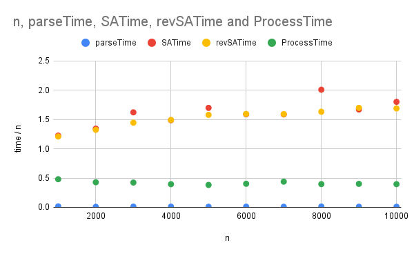
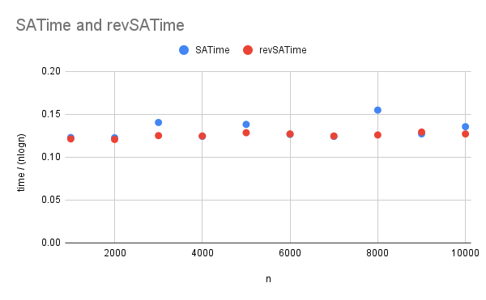
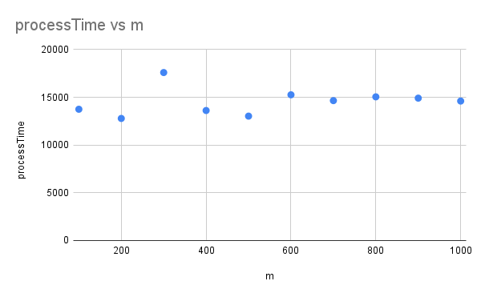
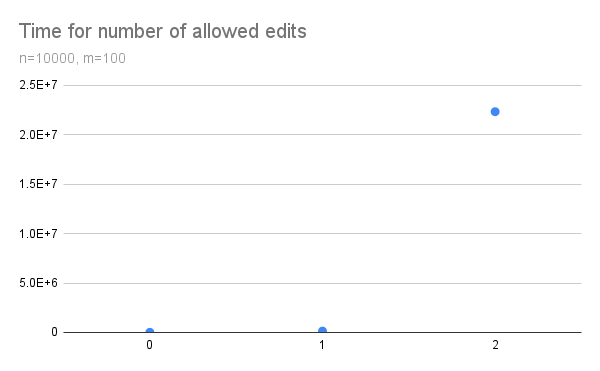

[](https://classroom.github.com/online_ide?assignment_repo_id=9424447&assignment_repo_type=AssignmentRepo)
# Project 5: building your very own readmapper

In this final project, you will write a complete read mapper.

The read mapper should be able to preprocess a reference genome. To avoid preprocessing each time you need to map reads, you should store the preprocessed data structures on disk. Reference genomes come in Simple-FASTA format, as usual, and reads in Simple-FASTQ format, and your tool must write matches to standard out in Simple-SAM.

Your program, which should be named `readmap`, and should take the following options:

* `readmap -p genome.fa` should preprocess the genome
* `readmap -d k genome.fa reads.fq` should do read-mapping for matches within an edit distance .


## Assembly required

If you have made all project and all exercises you will have most of what goes into a readmapper.

1. You implemented the file format parsers in the first week of the class, and you have been using them in the four previous projects.
2. If you map using a suffix tree, you have implemented it in project 2.
3. If you map using Li & Durbin’s algorithm you implemented most of the necessary data structures in projects 3 and 4.

## Batteries not included

You have not implemented approximative matching, so you have to implement that now.

## Testing

You can use the [gsa] Python package for generating test data and running tests. You can clone it from the GitHub repository or use:

```bash
> python3 -m pip install git+https://github.com/birc-gsa/gsa#egg=gsa
```

Amongst other things, the tool can simulate data. If you run, for example

```bash
> gsa simulate genome 23 100000 > genome.fa
```

you will simulate a genome with 23 chromosomes, each of length 100,000.

After that,

```bash
> gsa simulate reads genome.fa 2000 100
```

will simulate 2000 reads of length 100.

If you then do

```bash
> gsa search genome.fa reads.fq approx -e 1 bwt
```

to find all the hits within one edit distance of a read. If you want it faster, preprocess the genome first with

```bash
> gsa preprocess genome.fa approx-bwt
```

You should notice a speed difference; you want to achieve the same with your own preprocessing.

You can use the tool to test your read mapper as well. This requires a spec file that defines how tools should be tested. It can look like this:

```yaml
tools:
  GSA:
    preprocess: "gsa preprocess {genome} approx-bwt"
    map: "gsa search {genome} {reads} -o {outfile} approx -e {e} bwt"
  readmap:
    preprocess: "{root}/readmap -p {genome}"
    map: "{root}/readmap -d {e} {genome} {reads} > {outfile}"

reference-tool: GSA

genomes:
  length: [1000, 5000, 10000]
  chromosomes: 10

reads:
  number: 10
  length: 10
  edits: [0, 1, 2]
```

The `tools` section is a list of tools to run, each with a `preprocess` and a `map` command line. You can have as many as you like. The `reference-tool` selects which tool to consider “correct”; all other tools are compared against its results. Then `genomes` specify the genome length and number of chromosomes. Lists here will add a test for each combination. Similarly, the `reads` specify the reads, their number and length and how many edits the simulation and the readmapping will use.

The variables in `{...}` are used by `gsa` when you specify command lines. `{root}` refers to the directory where the YAML file sits, so if your tool and the YAML file are in the same directory, your tool is at `{root}/readmap`. The `{genome}` and `{reads}` tags are the input files and `{outfile}` the name of the output file. Don’t get inventive with the command line for your tool, though, I also have a test ready to run, and if you do not implement the interface specified above, the test will fail (and that will be your problem and not mine).

If you put this file in `tests.yml`, and you have the tool `readmap`, you can run the test with

```bash
> gsa -v test tests.yaml
```

The read mapper in `gsa` doesn’t output matches with leading or training deletions. We talk about why, and how you avoid it as well, in the exercises. Keep that in mind when you are developing your own tool.

## Evaluation

Once you have implemented the `readmap` program (and tested it to the best of your abilities) fill out the report below, and notify me that your pull request is ready for review.

# Report

## Algorithm

*Which algorithm did you use for read mapping?*
We used a bwt based approach.

## Insights you may have had while implementing the algorithm

### Assumptions
* The inputs are valid fasta and fastq files.
* Sequences contain dna with only symbols from acgt.
* The number of allowed edits is small enough that we can allocate memory of that size.

## Problems encountered if any

This project was more difficult than the four previous projects. <br>
The recursion was difficult to get a handle on. We started by making a fusion of recursion and explicit
stack-based programing. In the recursion we had some issues, because we were passing references instead of values. 
We latter changed it. This meant, that we had to reset the value to their previous state, once a function call was popped from the stack.
<br>
Like in previous projects memory managing was a recurrent problem, but we are way better at handling them now. <br>
Because we worked both radix sort and prefix doubling, we have a lot of dead code in the project. 

## Validation

*How did you validate that the algorithm works?*

We made tests for sub elements used on the main function. These tests where explicit in what output we expected. <br>
We were able to test the approximation match with no allowed edits the most, since we could easily compare to the other projects. <br>
Note that we also rely on the correctness of the implementation from the previous projects. This include comparing comparing sa construction using radix sort with sa construction using prefix doubling <br>

## Running time

*List experiments and results that illustrates the running time. Add figures by embedding them here, as you learned how to do in project 1.*

### Timeline of running time
The code is run on the following machine: <br>
Lenovo Legion 5 <br>
Processor	AMD Ryzen 7 4800H with Radeon Graphics   2.90 GHz <br>
Installed RAM	16.0 GB (15.4 GB usable) <br>
Running Windows 11 <br>

#### Version 1.0 29/11
First working version

Preprocessing on long.fa: 22 minutes, 32 sec. <br>
Search k=0, on long.fa and long.fastq: 13.659 sec. <br>
Search k=1, on long.fa and long.fastq: 14.276 sec. <br>
Search k=2, on long.fa and long.fastq: 59.95 sec. <br>
Search k=3, on long.fa and long.fastq: 10 minutes, 30 sec.  <br>
Search k=4, on long.fa and long.fastq: 16 minutes, 32 sec.  <br>

#### Version 1.1 29/11
Recursion with value instead of reference

Search k=0, on long.fa and long.fastq: 15 sec. <br>
Search k=1, on long.fa and long.fastq: 14.316 sec. <br>
Search k=2, on long.fa and long.fastq: 56.788 sec. <br>
Search k=3, on long.fa and long.fastq: 9 minutes, 52 sec.  <br>
Search k=4, on long.fa and long.fastq: 15 minutes, 48 sec.  <br>

#### Version 2.0 2/12
Switched from radix sort to prefix doubling sort. <br>
Introduced Fastq struct.
reprocessing on long.fa: 32 sec. <br>
Search k=0, on long.fa and long.fastq: 4.418 sec. <br>
Search k=1, on long.fa and long.fastq: 6.6 sec. <br>
Search k=2, on long.fa and long.fastq: 42.374 sec. <br>
Search k=3, on long.fa and long.fastq: 8 minutes, 32 sec.  <br>
Search k=4, on long.fa and long.fastq: 13 minutes, 57 sec.  <br>
<br>

These times are measured while we still have a lot of dead code. 



Sa construction follows O(n log n)


Processing the reads looks almost constant.  



Added more allowed edits makes the code run way slower. 

